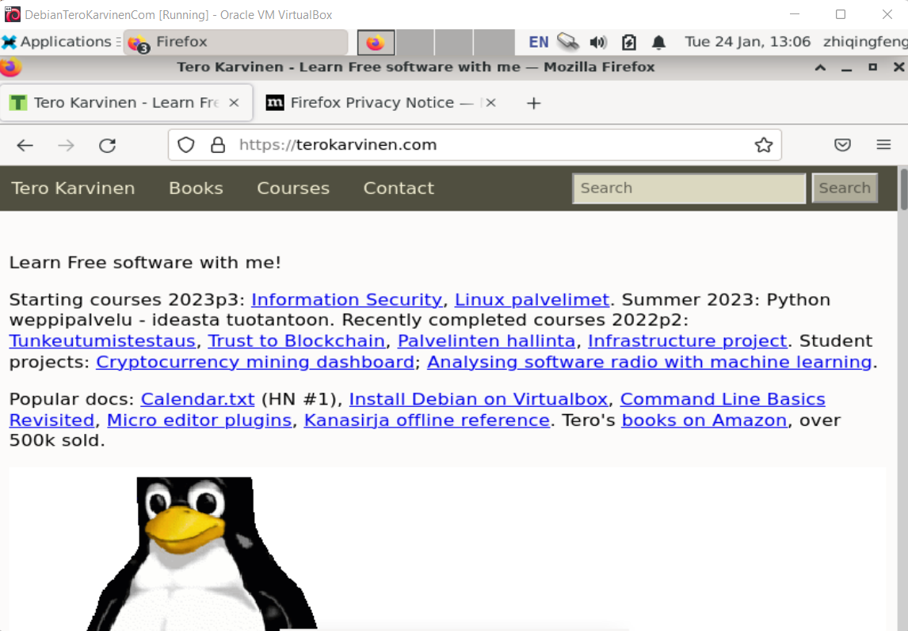
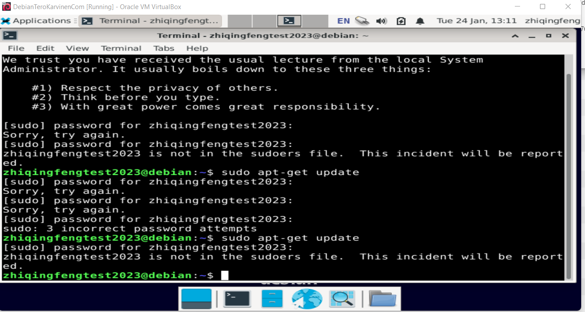

> h1-First_step

Here have a problem that I couldn't choose to Live when i installed the Debian GNU/Linux Live.
Now I am installing the Debian installer. Evrything on the process. Not so sure can I install this? 

Update:
Now I could log in after installed the Debian Installer.
 

I couldn't use sudo command. 

 
I think this casued by i installed the Debian installer but not Debian GNU/Linux live.
-----------Start Over-----------
Step 1: 
- Installed the VirtualBox on Macbook, and created a new Virtual Machine. 
Setp 2:
- Started the app, choosed Debian GNU/Linux Live (kernel 5.10.0-20amd64)
- It didnt work again, so I installed the Debian Installer again on Macbook.
-----------Start Over again------------
Step 1:
Go back to Windows laptop and log in the application.
Step 2:
I typed sudo apt-get update.But there displayed my username is not in the sudoers file. This incident will be reported. 
Now looking for the root reason of this issue. :( 

--------UPDATE-----------
1. installed the UPM and logged in Debian successfully. :) (So I am doing everything in DebainLinuxBullsEye) 
2. Installed and Ran WebGoat. But I couldn't run the java command --> (bash:java:command not found) 
3. Looking for the solution about java command. 
4. Installed Java and Javac, and now it's available to use java command and registered on WebGoat successfully. :) 
5. Hacker warmup
   1) General: HTTP Basics
     - Entered my name and press GO!. 
     - Magic number is 71. Found it from the HTML by searched the keyword.
   3) General: Developer tools
     - PhoneHome response is 807131848
     - networkNum: 14.930557891802575
